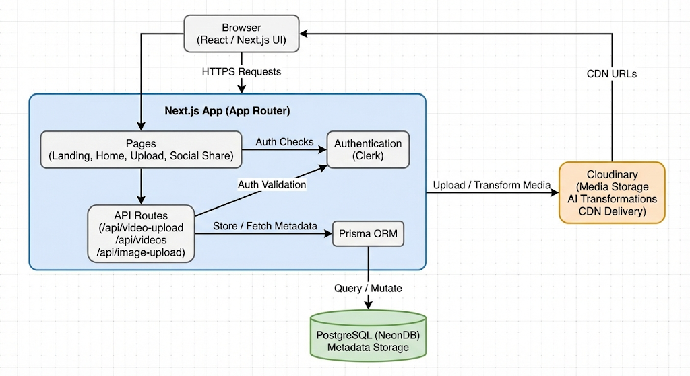

# Media Optimization SaaS

A **Media Optimization SaaS** that demonstrates real-world engineering decisions around **media-heavy applications**.  
Built using **Next.js App Router**, **Cloudinary**, **Prisma**, and **PostgreSQL (NeonDB)**, the project focuses on **video compression** and **context-aware image optimization** for different platforms.

---

## Demo

> Demo video placeholder (will be updated)


---

## Core Features

### Video Optimization
- Upload videos with title and description
- Automatic compression using Cloudinary
- Content-aware hover preview (AI-selected segments)
- Download optimized videos
- Displays original size, compressed size, duration, and compression percentage

### Social Media Image Formats
- Upload an image once
- Generate optimized formats for:
  - Instagram (1:1, 4:5)
  - Twitter (16:9, Header)
  - Facebook Cover
- AI-based context-aware cropping (not naive resizing)
- Instant preview and download

### Authentication & UX
- Secure email-based authentication with Clerk
- Protected routes for uploads and transformations
- Centralized toast notifications
- Responsive UI built with Tailwind CSS and DaisyUI

---

## Tech Stack

- **Next.js (App Router)**  
  Full-stack React framework used for routing, layouts, and API routes.

- **Cloudinary**  
  Handles media storage, AI-based image/video transformations, and CDN delivery.  
  All heavy media processing is offloaded from the application server.

- **PostgreSQL (NeonDB)**  
  Serverless relational database used to store media metadata and ownership.

- **Prisma**  
  Type-safe ORM for schema modeling, migrations, and database access.

- **Clerk**  
  Authentication and session management with email verification.

---

## High-Level Architecture




**Design Choice:**  
Media files are stored in Cloudinary.  
The database stores **only metadata and references**, never large files.

---

## Local Setup

```bash
- git clone https://github.com/utkarshkrishna2004/media-optimization-saas.git
- cd media-optimization-saas
- npm install
```
## Create a .env file:
```bash
- NEXT_PUBLIC_CLERK_PUBLISHABLE_KEY = ******
- CLERK_SECRET_KEY = ******

- NEXT_PUBLIC_CLERK_SIGN_UP_URL=/sign-up
- NEXT_PUBLIC_CLERK_SIGN_IN_URL=/sign-in

- DATABASE_URL = ******


- NEXT_PUBLIC_CLOUDINARY_CLOUD_NAME = ******
- CLOUDINARY_API_KEY = ******
- CLOUDINARY_API_SECRET = ******
```

## Run migrations and start the app:

```bash
- npx prisma migrate dev
- npm run dev

```

## Author

### Utkarsh Krishna

GitHub: https://github.com/utkarshkrishna2004

LinkedIn: https://www.linkedin.com/in/utkarsh-krishna-3bab41240/
